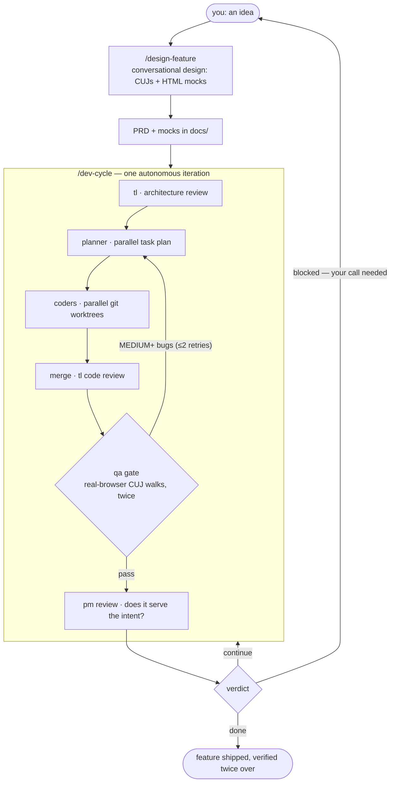

# Multi-Agent Development Setup

**A team of specialized AI agents that takes a feature from product design to verified implementation — with you at the decision points, not in the weeds.**

You describe what to build. The agents design it with you, plan it, build it in parallel git worktrees, test it in a real browser, and stop with a clear question whenever a decision is genuinely yours.

Works on **Claude Code** (reference implementation, used in all examples below), with ports for **OpenAI Codex** and **Google Antigravity** — see [Platforms](#platforms). Everything is markdown conventions in your project's `docs/` — no databases, no services.

---

## How it works



Run the loop continuously with `/loop /dev-cycle` — it iterates until `done` or `blocked`.

### The agents

| Agent | Role |
|---|---|
| `pm` | Product manager + designer — feature discovery, CUJ specs, HTML mocks, intent review |
| `tl` | Architect — design docs, technical decisions, code-quality review |
| `planner` | Decomposes work into parallelizable tasks |
| `coder` | Implements one task in its own git worktree (many run at once) |
| `qa` | Verification **with gate authority** — drives a real browser/device, walks every journey twice, detects fabricated implementations |
| `status` | Keeps a one-page project snapshot current |
| `gorilla` | Adversarial exploratory tester — tries to break the running app |

### Three kinds of work, three intakes

| Work | Command | What happens |
|---|---|---|
| **Feature** | `/design-feature` | design conversation → PRD + mocks → build loop |
| **Defect** | `/report-bug` | inbox entry → `/triage` → `/quick-fix` or escalate |
| **Eng task** (infra, tooling, tech debt) | `/eng-task` | backlog entry with an executable done-check → scheduled by the planner |

---

## Quick start

Requires [Claude Code](https://claude.com/claude-code).

**1. Clone and deploy** (symlinks into `~/.claude/`, so edits in your clone apply immediately):

```bash
git clone <this-repo> && cd <this-repo>
./claude/deploy.sh
```

> ⚠️ The script **replaces** any existing `~/.claude/agents`, `commands`, `CLAUDE.md`, and `settings.json` — back up and merge yours first. Also review [`claude/settings.json`](claude/settings.json): it pre-approves broad tool permissions so the loop runs unprompted; trim to your comfort level.

**2. Give QA a real browser:**

```bash
claude mcp add --scope user playwright -- npx -y @playwright/mcp@latest
```

**3. Try it** in any project:

```
/design-feature "users need a theme switch"
/loop /dev-cycle
```

Adopting an existing codebase? Run `/organize-project` once to retrofit it into the pattern.

---

## Day-to-day

```
/design-feature "<pitch>"       design a feature together — CUJs + mocks, then PRD
/loop /dev-cycle                build autonomously until done or blocked

/report-bug "<what broke>"      file a defect (screenshots supported)
/triage                         diagnose open defects, recommend a path
/quick-fix <id>                 fix small-scope items directly
/eng-task "<task>"              file infra/tooling/tech-debt work

/gorilla-test --time 30m        adversarial testing session on the running app
/worktree-start <slug>          parallel Claude session on its own branch
```

---

## Platforms

| Platform | Directory | Coverage |
|---|---|---|
| **Claude Code** | [`claude/`](claude/) | Full setup — source of truth |
| **OpenAI Codex** | [`codex/`](codex/) | Core agents + loop, synced from the Claude source |
| **Google Antigravity** | [`antigravity/`](antigravity/) | Core skills, synced from the Claude source |

Each directory has its own `deploy.sh`. The Claude Code setup is canonical; the ports are regenerated from it and may trail behind.

---

## Learn more

The full reference — architecture, design decisions, file conventions, Android/CLI testing prerequisites, verification checklist — lives in **[the manual](claude/claude-code-multi-agent-setup.md)**.

## License

[MIT](LICENSE)
